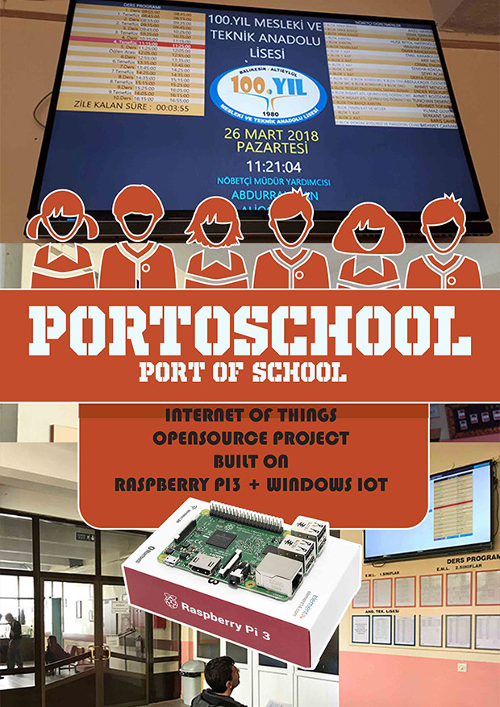

# PortoSchool IOT
 A Raspberry Pi3 Project Currently Working in front of a School Entry on a Giant Monitor. Kiosk Display for School news at the School Entry. Shows  ulletins / Announcements, Daily Weekly Course Plan and Sentry Staff of the day as Pictures and Documents as a Slide and also Current Weather, Daily School Sentries etc.

You can run or deploy portoschool on any windows dependent operating system.
Thus, it can run on windows 10 or higher, Windows IOT (which is specified for single-board mini
computers).

##### For full documentation download: [PortoSchool.pdf](./PortoSchool/Assets/PortoSchool.pdf)

---
>## Authors
>
  **Kursat Turkay** - Contributor [PortoSchool](https://github.com/kursatturkay/PortoSchool)

---

>#### License

This project is licensed under the Mozilla Public License Version 2.0 - see the [LICENSE.md](./LICENSE.md) file for details

---
>
>## Contributing
>

Please read [CONTRIBUTING.md](https://github.com/kursatturkay/PortoSchool/blob/master/CONTRIBUTING.md) for details on our code of conduct, and the process for submitting pull requests to us.
